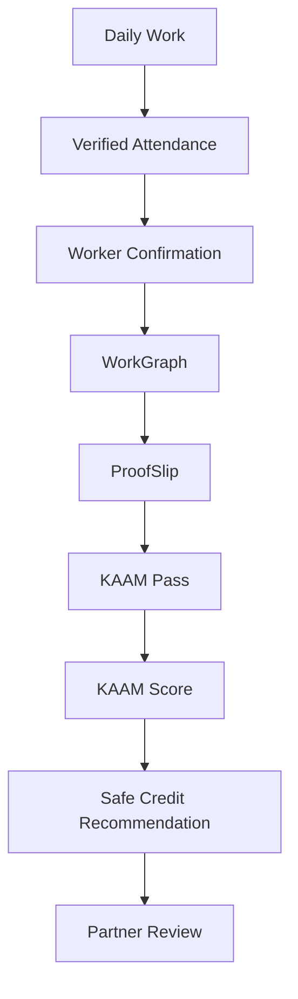

# 🌉 KAAM Setu AI

**ULI-Ready Proof-of-Work Financial Identity Rail for Informal Workers**

> *KAAM Setu does not start at the loan application. It starts at the worksite, where trust is created.*

**KAAM Setu AI** converts informal daily work into verifiable income credentials and ULI-ready data APIs, helping regulated lenders safely assess workers who have no traditional credit history.

---

## 🚨 Problem Statement

Millions of informal workers work every day, but their income is invisible to formal finance.

A construction worker like Ramesh may earn regularly, but lenders cannot easily verify:
- Did he actually work?
- Where did he work?
- Who verified the work?
- Was the wage proof edited?
- Is the contractor reliable?
- Is the income stable?
- Is the requested loan safe?
- Did the worker consent to share this data?

Because this trusted evidence chain does not exist, informal workers are often rejected by banks, NBFCs, insurers, and welfare systems.

---

## 💡 Solution

KAAM Setu AI creates the missing **Proof-of-Work financial identity layer**.

It verifies daily work at the source, converts it into tamper-evident income proof, and exposes it through consent-based partner APIs.

- ❌ The system does **not** lend money directly.
- ❌ It does **not** act as an insurer.
- ✅ It creates **verified data** and **safe credit recommendations** for regulated partners.

---

## ⚙️ Core Idea



---

## ✨ Key Features

### 1. 🕸️ WorkGraph
A trusted graph that proves where, when, and how a worker earned.

`Worker → Site → Contractor → Attendance → ProofSlip → KAAM Pass → Partner Review`

**Example:**
*Ramesh K → Green Valley Apartments → Manjunath Constructions → 24 verified work days → 2 QR/hash verified ProofSlips → ₹16,800 verified monthly income → KAAM Score 88*

### 2. 🔺 Trust Triangle
KAAM does not trust one party blindly. It cross-verifies:

| Trust Layer | What It Proves |
| --- | --- |
| **Worker Confirmation** | Worker agrees the work record is true |
| **Contractor Trust Score** | Wage-data source is reliable |
| **Hash-Verified ProofSlip** | Income proof was not silently altered |

### 3. 🧾 ProofSlip
A **ProofSlip** is a tamper-evident wage proof generated from verified attendance.

`Verified Attendance → Wage Calculation → ProofSlip Generation → SHA-256 Hash → QR Verification Page → DigiLocker-Ready Credential`

**The public QR page shows only safe fields:**
- Verified: Yes
- Worker: Ramesh K
- Site: Green Valley Apartments
- Period: 01–15 June
- Net Pay: ₹8,400
- Hash Match: Yes

*(Sensitive information such as phone number, Aadhaar, disputes, and loan recommendations is not exposed publicly.)*

### 4. 🪪 KAAM Pass
KAAM Pass is the worker-owned financial identity profile.
It includes:
- Worker ID & Skill
- Verified work history & ProofSlip history
- Verified income estimate
- KAAM Score & Safe loan recommendation
- Income shock status & Consent status

**Workers can access it through:**
- Printed KAAM card with QR
- Missed call / IVR
- Assisted access (contractor, NGO, banking correspondent)
- Future DigiLocker integration

### 5. 🔐 Consent Gateway
Lenders or partners cannot directly access worker data.

**Consent flow:**
1. Partner requests access
2. Worker receives IVR / SMS consent prompt
3. Worker presses 1 to allow or 2 to reject
4. Temporary partner access is created
5. Access expires automatically

**Worker remains in control of:** Who can view data, what is shared, duration, and revocation.

### 6. 📊 KAAM Score
An explainable dynamic trust score based on verified work evidence.

| Component | Weight |
| --- | ---: |
| Attendance Reliability | 25 |
| Wage Stability | 20 |
| Contractor Reliability | 15 |
| Payment Consistency | 15 |
| Worker Confirmation Rate | 10 |
| Dispute Risk | 10 |
| Fraud / Anomaly Risk | 5 |
| **Total** | **100** |

### 7. 🛡️ Responsible Credit Firewall
KAAM does not maximize loan size. KAAM maximizes repayment safety.

- **Verified Weekly Income** = Verified Monthly Income / 4
- **Maximum Weekly Repayment** = Verified Weekly Income × 20%
- **Safe Loan Limit** = Maximum Weekly Repayment × Tenure Weeks

**Example:**
*Verified monthly income: ₹16,800 ➔ Verified weekly income: ₹4,200 ➔ Safe weekly repayment cap: ₹840 ➔ Tenure: 6 weeks ➔ Safe loan limit: ₹5,040 ➔ KAAM recommendation: ₹4,000–₹5,000*
*(The final lending decision is made by a regulated lending partner.)*

### 8. 🌩️ Income Shock Radar
Detects early signs of income interruption.

| Trigger | Signal |
| --- | --- |
| **Work stoppage** | No attendance after stable work |
| **Wage delay** | ProofSlip generated but payment pending |
| **Site shutdown** | Contractor marks site paused |
| **Accident** | Worker or contractor reports accident |
| **Weather disruption**| Rain, heatwave, flood, or local event |

*Output: Income shock detected ➔ Emergency support case created ➔ Partner review required.*

---

## 🗣️ Worker-Friendly Design
The worker does not need to use a complex app. The worker experience is **voice-first**:

**Attendance Confirmation Example:**
> "Namaste Ramesh. You were marked present today at Green Valley Site. If you were present, press 1. If this is wrong, press 2. To hear again, press 0."

**Consent Example:**
> "A lending partner wants to view your KAAM income proof. They can see your ProofSlips and KAAM Score for 7 days. Press 1 to allow. Press 2 to reject."

---

## 🔄 End-to-End Workflow

```text
Contractor Onboards Worker ➔ Worker Receives SMS + KAAM Pass ➔ Contractor Marks GPS Attendance ➔ Worker Confirms by IVR ➔ WorkGraph Node Created ➔ ProofSlip Generated ➔ KAAM Pass Updated ➔ KAAM Score Calculated ➔ Partner Requests Access ➔ Worker Gives IVR Consent ➔ Partner Reviews Verified Income Proof ➔ Responsible Credit Recommendation ➔ Income Shock Radar ➔ Emergency Support Workflow Triggered
```

---

## 🏗️ System Architecture & Tech Stack

### Tech Stack
- **Frontend:** React, Vite, Tailwind CSS
- **Backend:** FastAPI, Python, PostgreSQL / SQLite, SQLAlchemy / SQLModel, Pydantic
- **Verification:** GPS/geofence validation, SHA-256 hashing, QR code verification
- **Worker Access:** IVR/missed-call simulation, Vapi.ai for demo calls, SMS-ready flow, Printed KAAM Pass
- **AI / Scoring:** Rule-based explainable KAAM Score, Fraud/anomaly detection, Safe credit recommendation engine, Optional LLM score explanation
- **Deployment:** Vercel/Netlify (Frontend), Render/Railway (Backend), Supabase/Neon (Database), GitHub

### MVP Scope (Hackathon)
**Built in MVP:**
Contractor dashboard, Worker onboarding, Site creation, GPS attendance, Worker confirmation flow, WorkGraph node creation, ProofSlip generation, QR verification page, KAAM Pass page, KAAM Score calculation, Responsible Credit Firewall, Partner request dashboard, Consent simulation, Income Shock Radar, Mock lender/welfare workflow.

**Mocked for Hackathon:**
ULI lender handshake, DigiLocker ProofSlip push, Account Aggregator consent rail, Real loan disbursement, Real insurance payout.
*(Production integration requires official onboarding with the respective ecosystem participants.)*

---

## 💼 Business Model
**Workers pay nothing.** Revenue comes from institutions that benefit from verified informal-income data.

| Customer | Revenue Model |
| --- | --- |
| **Contractors** | SaaS subscription |
| **Lenders / NBFCs** | Verification API fee / success fee |
| **Insurers / Welfare**| Integration or case fee |
| **NGOs / CSR** | Worker onboarding and impact reporting fee |

> *Core principle: Monetize verification, not worker vulnerability.*

---

## ⚖️ Why KAAM Setu AI Is Different

| Normal Approach | KAAM Setu AI |
| --- | --- |
| Starts at loan application | **Starts at the worksite** |
| Uses existing financial data | **Creates verified work data** |
| Uploads documents | **Generates tamper-evident ProofSlips** |
| Black-box score | **Explainable KAAM Score** |
| Direct loan claim | **Safe credit recommendation** |
| App-first | **Voice-first for workers** |
| Consent as afterthought | **Consent-first access** |
| Worker pays | **Worker pays nothing** |

---

## 🔒 Privacy and Safety
**KAAM does not collect:** Aadhaar in MVP, UPI PIN, OTP, Bank password, Card details, Worker biometrics.
**KAAM uses:** Consent-based access, Limited QR data, Expiring partner access, Audit logs, Hash verification, No public exposure of sensitive financial data.

---

## ❓ Judge Q&A

**Q: Is this just payroll?**
A: No. Payroll apps manage employer records. KAAM converts verified wage records into worker-owned financial identity and ULI-ready credit evidence.

**Q: Is this just credit scoring?**
A: No. KAAM creates the verified income evidence chain before scoring. The score is only one output of the proof layer.

**Q: Are you giving loans?**
A: No. KAAM does not lend or approve loans. KAAM gives verified income credentials and safe credit recommendations to regulated lending partners.

**Q: Are you integrated with ULI?**
A: For the MVP, we simulate a ULI-style lender handshake through standardized APIs. KAAM is designed to become a future data service provider because its core value is verified informal-income data.

**Q: Are you integrated with DigiLocker?**
A: The MVP generates QR/hash verified ProofSlips. The production version can onboard as a DigiLocker issuer and push ProofSlips into the worker’s DigiLocker.

**Q: What if the contractor lies?**
A: KAAM uses trust levels: contractor-only, GPS-verified, worker-confirmed, and pattern-verified. No single party is blindly trusted.

**Q: What if the worker has no smartphone?**
A: KAAM supports missed call, IVR, printed KAAM Pass, and assisted access. The worker does not need an app.

**Q: What about privacy?**
A: KAAM uses consent, expiry, revocation, audit logs, limited QR data, and no Aadhaar in MVP.

---

## 🚀 Future Roadmap

- **Phase 1: Hackathon MVP** - Core dashboards, Attendance, WorkGraph, ProofSlip, KAAM Score, Consent simulation.
- **Phase 2: Pilot** - Real contractor onboarding, Multilingual IVR, Field testing with worker feedback.
- **Phase 3: Production** - DigiLocker issuer integration, ULI ecosystem onboarding, Account Aggregator alignment, NBFC/NGO integrations.
- **Phase 4: Scale** - Construction workers, Rural masons, Plumbers, Electricians, Tailors, Vendors, Self-employed rural earners.

---

### Final Statement
**KAAM Setu AI transforms verified daily work into trusted financial identity infrastructure.**
It does not ask informal workers to become digital. It makes their daily work digitally valuable.
